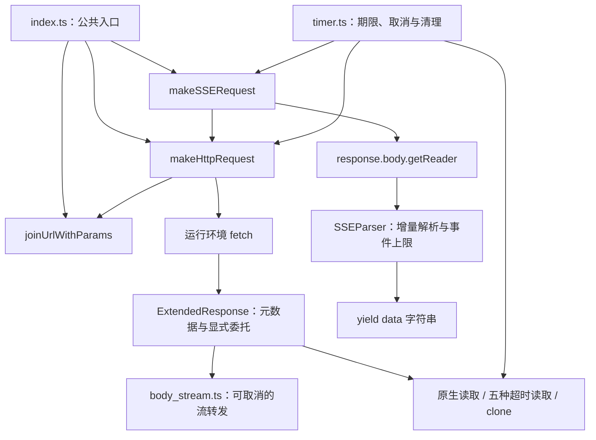

# 架构与行为边界

本文对应 B01–B15 修复后的实现。对外用法见 [README](../README.md)，测试方式见 [维护指南](development.md)，历史问题与验收对应关系见 [修复记录](bug-audit.md)。

## 模块与调用路径

包根只导出三个运行时函数 `joinUrlWithParams`、`makeHttpRequest`、`makeSSERequest`，以及 `HttpMethod`、`ExtendedResponse` 两个类型。解析器、计时工具、流管理和响应工厂是内部实现，不鼓励依赖深层模块。

## 请求准备与响应头阶段

`http_client.ts` 先校验超时和已中止的 signal，再合并 query、复制 headers、准备 body。URL 先拆 fragment，再用 `URLSearchParams` 合并已有 query；同名键覆盖，空参数保持原 URL。三个公开函数的 query 值类型统一为 string/number/boolean。

请求头内部使用 `Headers`，不改变调用者的对象。字符串/数字默认 text/plain，普通对象/数组默认 application/json，但保留显式 Content-Type。FormData 删除副本中的 Content-Type，让 Fetch 补 boundary。Blob、URLSearchParams、ArrayBuffer 及其 view 直接传递，其他顶层类型明确报错。

外部 signal 转发到本次请求的内部 `AbortController`。在安装监听器后再次检查 aborted，防止 headers getter 或 `toJSON()` 在同步准备期间触发取消而被漏掉。已取消的请求不会进入 Fetch。

`withTimeout` 从调用 Fetch 到收到响应头计时；到期以 `TimeoutError` 中止内部控制器。成功和所有失败路径都清除 timer。若一个忽略 signal 的 Fetch 实现迟到返回响应，立即取消其 body，不再返回给调用者。查询处理和 JSON 序列化属于计时前的同步准备。

收到响应头后进入 `ExtendedResponse.create`。HTTP 4xx/5xx 原样返回；SSE 在其上增加非 OK 检查并抛出带 `status`、`statusText` 的 `HTTPError`。没有自动重试、拦截器或业务错误格式。

## 响应体与克隆

`ExtendedResponse` 不使用 Proxy，也不追求原生 Response 身份。它保存原响应的 `ok/status/statusText/url/redirected/type`，通过明确的 getter 暴露这些元数据。body 和 headers 由内部 Response 负责，公开方法在实例创建时绑定，因此读写扩展属性、反射和方法引用一致。

对非空 body，工厂先用 `manageBody` 包装原始字节流，再构造只负责 body/headers 的内部 Response。新构造 Response 的默认 status/url 等不会暴露给调用者；这避免重建 body 时丢失重定向地址和原始状态。空 body 直接使用原 Response，结束请求级监听器的生命周期。

`manageBody` 持有一个源 reader，使用零高水位的转发流，按需把字节交给下游，不主动聚合整个响应体。EOF、错误或取消时释放源 reader 并通知上层清理。中止时让转发流报错，同时取消源分支。原生 tee 的取消 Promise 可能要等其他 clone，因此中止不会等待该 Promise 才返回超时错误，但仍处理其拒绝。

`clone()` 使用内部 Response 的原生 clone，保留相同元数据，产生独立 headers 和 body 分支。原生的一次性读取、锁和已消费检查继续有效。一个分支超时只取消自身；其他分支还能继续读取。所有分支取消后才取消共享源。外部 signal 则中止共享输入流，影响仍在读取的所有分支。

这也意味着未消费的 clone 可以保留缓冲和连接；应用应读取或取消不再需要的分支。扩展响应不是原生子类，不承诺 `instanceof Response` 或借用原生原型方法时通过品牌检查。

## 五种读取超时

`jsonWithTimeout`、`textWithTimeout`、`arrayBufferWithTimeout`、`blobWithTimeout`、`bytesWithTimeout` 共用读取路径：

1. 校验 deadline，确认对应原生方法存在；失败不消费 body。
2. `0` 或空 body 直接委托原生方法。正数 deadline 在确认 body 未用且未锁后建立当前分支的 `manageBody`。
3. 用该转发流构造临时 Response，调用原生转换方法，并由 `withTimeout` 计时。保留 headers，使 blob 的 MIME 等转换语义一致。
4. 到期取消当前分支；成功或失败均清理 timer。转换异常向外传播，不会被清理过程替换。

超时从读方法开始计算，与此前已经结束的响应头 timer 无关。原生 `json/text/arrayBuffer/blob/bytes/formData` 不额外计时。没有 formDataWithTimeout，也没有 bytes 回退；缺少 `Response.bytes()` 时只在调用相关方法时出错。

## SSE 生成器与解析器

生成器在首次迭代时校验两个 deadline 和事件上限，加入默认 Accept，然后通过普通 HTTP 路径获取响应。每次 `reader.read()` 单独使用 `messageTimeoutMs`；碎片和心跳都会满足本次读取，消费者停留在 yield 时没有读取 timer。`0` 可关闭期限，没有额外的完整事件等待上限。

解析器保持当前行、累计 data 行、当前事件字节数和 CRLF 状态。逐字节扫描新增块；行缓冲按几何级数扩容，只在完整行时解码。UTF-8 字符可以跨任意网络块，CRLF 也可跨块。无需每次重扫全部残留，处理开销随输入长度线性增长（缓冲扩容按摊销计算）。

采用 [SSE 行与事件规则](https://html.spec.whatwg.org/multipage/server-sent-events.html#parsing-an-event-stream)：

- LF、CRLF、CR 都可结束行，只移除整个流最开始的一个 BOM。
- 注释与未知字段不产生 data；`event/id/retry` 也忽略，公开结果仍是字符串。
- 首个冒号分隔字段和值，只移除值开头的一个 ASCII 空格，不整体 trim。
- 多个 data 行以换行拼接，存在空 data 行时可产出空字符串；无 data 的空帧不产出。
- 空行结束事件；EOF 不补发残留。[标准 EOF 行为](https://html.spec.whatwg.org/multipage/server-sent-events.html#event-stream-interpretation)

单事件默认上限 8 MiB，统计空行之间各行的非换行原始 UTF-8 字节，包含字段名、注释和忽略字段。超限抛 RangeError；上限必须为正的安全整数。空行后重置计数，避免未结束帧无限增长。大小限制不等于时间限制。

正常 EOF 返回 `true`；HTTP 错误、缺少 body、读取错误、超时、取消和超限都抛出。库不打印错误，不返回失败 false，不识别业务 `[DONE]`，不重连，不强制响应 MIME。

`finally` 对未完成的读取取消 body 并释放锁；在取得 reader 前遇到 HTTP 错误也会取消 body。消费者从 yield 处 break/return 同样触发清理。异步生成器会把 `.return()` 排在进行中的 `.next()` 后，要立刻打断等待中的读取必须用 AbortSignal。

## 生命周期检查点

| 结束原因 | 定时器 | 流与监听器 |
| --- | --- | --- |
| 收到响应头 | 清理 header timer | 外部 signal 保留到 body 完成/取消 |
| 请求失败或 header 超时 | 清理 header timer | 移除外部监听；超时 abort Fetch |
| 完整 body 读完或流报错 | 清理 read timer | 释放上游 reader，移除相关监听 |
| 某 clone 读取超时 | 清理该 read timer | 取消该分支，不等待其他分支 |
| 外部取消 | 清理活动 timer | 中止共享输入流并传播 reason |
| SSE break、超时、超限或非 OK | 清理活动 timer | 取消未使用 body，释放 reader |

`timer.ts` 把参数校验和清理机制集中起来；`0` 不创建 timer，其他合法值为 1–2147483647 的整数。计时器无法抢占同步 JavaScript，不能把它描述成 CPU 工作的强制执行上限。
